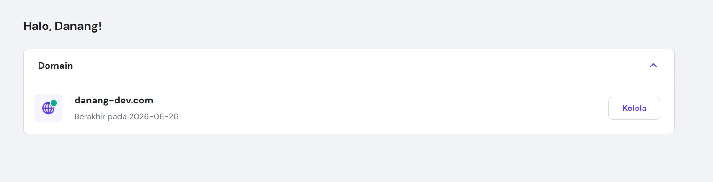
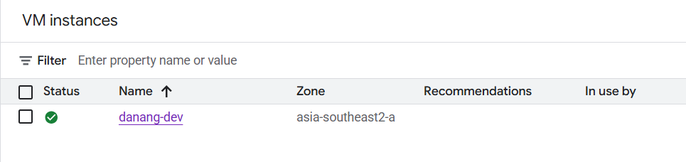
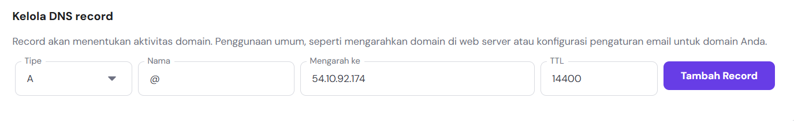
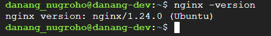
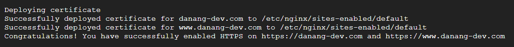
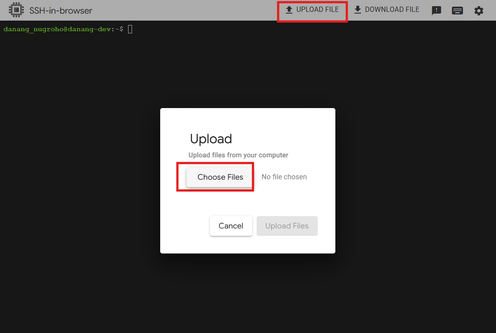

# Domain Setup for Website

## Domain



## Server



### Step by Step

1. Setup port


2. Add record

> A Record



> CNAME Record


3. Check Web Server 



4. Install Certbot (Let’s Encrypt Client)

```bash
sudo apt update
sudo apt install certbot python3-certbot-nginx -y
```

5. Make sure IP domain

```bash
ping danang-dev.com
```

6. Running Certbot

```bash
sudo certbot --nginx -d danang-dev.com -d www.danang-dev.com
```



### (Option 2) SSL Certificate

1. Upload SSL Certificate to GCP server
    - certificate.crt (danang-dev_com.crt)
    - private.key
    - ca_bundle.crt

2. Upload file using SSH



3. Move file to Directory SSL

```bash
sudo mkdir -p /etc/ssl/danang-dev
sudo mv /tmp/certificate.crt /etc/ssl/danang-dev/
sudo mv /tmp/private.key /etc/ssl/danang-dev/
sudo mv /tmp/ca_bundle.crt /etc/ssl/danang-dev/
sudo chmod 600 /etc/ssl/danang-dev/*
```

4. Merge Certificate

```bash
sudo cat /etc/ssl/danang-dev/certificate.crt /etc/ssl/danang-dev/ca_bundle.crt | sudo tee /etc/ssl/danang-dev/fullchain.pem
```

5. Configure Nginx

```bash
sudo nano /etc/nginx/sites-available/danang-dev.com
```

6. Type like this:

```nginx
server {
    listen 80;
    server_name danang-dev.com www.danang-dev.com;
    return 301 https://$host$request_uri;
}

server {
    listen 443 ssl;
    server_name danang-dev.com www.danang-dev.com;

    root /var/www/html;
    index index.html index.nginx-debian.html;

    ssl_certificate /etc/ssl/danang-dev/fullchain.pem;
    ssl_certificate_key /etc/ssl/danang-dev/private.key;

    ssl_protocols TLSv1.2 TLSv1.3;
    ssl_ciphers HIGH:!aNULL:!MD5;

    location / {
        try_files $uri $uri/ =404;
    }
}
```

7. Activate Nginx

```bash
sudo ln -s /etc/nginx/sites-available/danang-dev.com /etc/nginx/sites-enabled/
sudo rm /etc/nginx/sites-enabled/default
```

8. Test & reload Nginx

```bash
sudo nginx -t
sudo systemctl reload nginx
```

