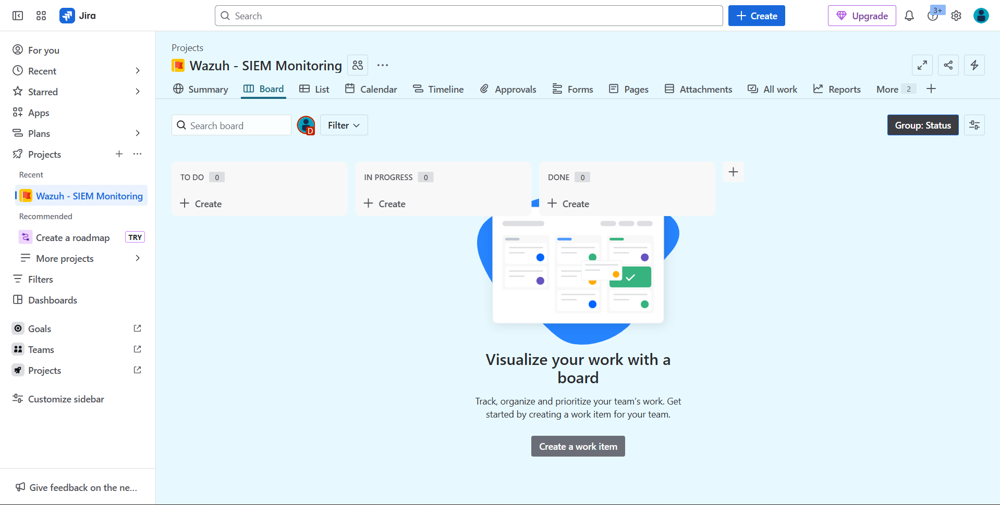

# Testing

## Jira Overview

## Create Projects

1. Klik icon `+` pada `Projects`

2. Pilih Project template / Blank project 

3. Isi detail dari project tersebut, lalu setelah itu klik `Create Project`

4. Isikan Email user yang bekerja pada project tersebut, dan assign role yang sesuai dengan user tersebut

5. Email Invited

6. Project Overview

### 1. Board

Project list action

### 2. List

Project list type

### 3. Project Date

Management Date for Project

## Example Project

### Wazuh - SIEM Monitoring

