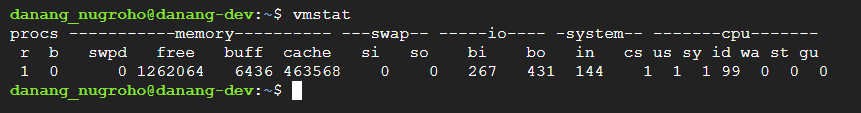
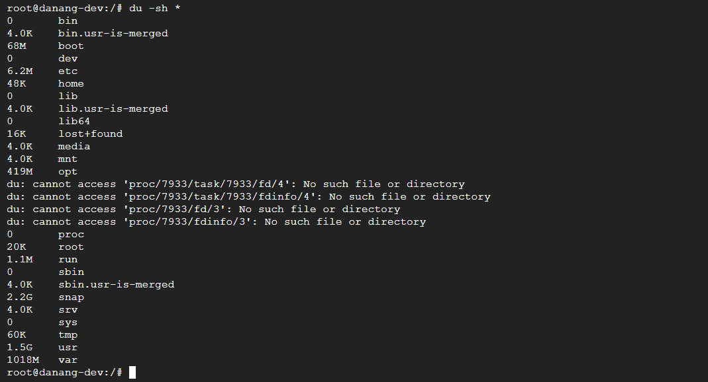
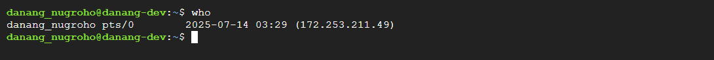

# How to Get Information About Your Linux System Through the Command Line

## Why It's Important to Understand Your Linux System

1. System Administration: 

System administrators must understand the system to effectively manage users and permissions, configure essential services, and automate tasks using scripts and cron jobs.

2. Troubleshooting

A solid understanding of the system specification and configuration enables quick error resolution, effective log analysis, and accurate diagnosis of network and hardware issues during system problems.

3. Security Auditing

If you are in a security-related role, knowing your system in depth helps you monitor unauthorized access, configure security policies, and detect and remove malicious processes or software.

4. Performance Optimization

If you know how to gather information about system resources, you can measure and project future usage, tune system parameters for efficiency, monitor resource consumption, and eliminate bottlenecks to optimize workloads.

5. Proactive Maintenance

It is good practice to prevent issues before they occur, and by knowing your system well, you can schedule regular updates and backups to ensure reliability and uptime.

## How to Get Your OS & Kernel Information in Linux

### 1. uname -a Command
`uname -a` provides full kernel information:

Here is what each part means in the above command:
- Linux: The kernel name.
- danang-dev.asia-southeast2-a.c.amd-production-362003.internal: The network hostname of the system.
- 6.11.0-1017-gcp: The kernel version and GCP-specific build.
- x86_64 x86_64 x86_64: The machine hardware name (architecture), processor type, and platform type, all indicating 64-bit x86 architecture.
- GNU/Linux: The operating system name.

### 2. uname -r and uname -s Commands
The `uname -r` and `uname -s` commands specify the kernel version and OS type information:

### 3. cat /etc/os-release Command
The `cat /etc/os-release` command provides distribution information:

Here is what each part means in the above command:
- PRETTY_NAME="Ubuntu 24.04.2 LTS": The user-friendly name of the distribution including version and LTS (Long Term Support) designation.
- VERSION="24.04.2 LTS (Noble Numbat)": The complete version information including:
    - 24.04: Major version (released April 2024)
    - .2: Point release number
    - LTS: Long Term Support
    - Noble Numbat: The release codename
- VERSION_CODENAME=noble: The codename for this Ubuntu release ("Noble").
- ID_LIKE=debian: Indicates that Ubuntu is based on Debian Linux.

### 4. hostnamectl Command
`hostnamectl` shows the hostname, OS, and kernel info:

In the above command, here is what each part means:
- Static hostname: "ip-172-31-90-178": This is the permanent hostname of the system, stored in /etc/hostname.
- Operating System: "Ubuntu 24.04.2 LTS": The current OS distribution and version.
- Kernel: "Linux 6.11.0-1017-gcp": The current Linux kernel version, specifically an GCP-optimized kernel.
- Architecture: "x86-64": The CPU architecture of the system.
- Virtualization: "google": Shows that this system is running on google virtualization (common for GCP instances).
- Hardware Vendor: "Google" Hardware Model: "Google Compute Engine": Indicates this is a Google Compute Engine domain user instance.
- Firmware Version: Google: This is the version of the firmware/BIOS specifically customized for GCP environments.

## How to Get Your CPU Information in Linux

### 1. lscpu Command
`lscpu` shows CPU architecture, cores, threads, and virtualization information:

Here is a brief explanation of the output above:
- CPU Architecture: x86_64 (64-bit)
- CPU Model: AMD EPYC 7B12
- Cores/Threads: 1 core, 2 thread (no Hyper-Threading)
- Virtualization Hypervisor: Running on KVM (full virtualization).
- Virtualization Support: Yes.

### 2. cat /proc/cpuinfo Command
`cat /proc/cpuinfo` provides more in-depth details about the CPU:

## How to Get Your Memory Information in Linux

### 1. free -h Command
You can use the `free -h` command to know the total/used/free RAM:

Here is a breakdown of the output shared above:
- total: The total amount of physical memory (RAM) or swap space available on the system.
- used: The amount of memory currently being used by applications and the system. Calculated as: total - free - buffers - cache.
- free: The amount of memory that is completely unused.
- shared: Memory that may be simultaneously accessed by multiple programs.

### 2. vmstat Command
`vmstat` stands for Virtual Memory Statistics, a tool to monitor system performance. It provides information about memory usage, CPU activity, Processes, Disk I/O and Swap usage.

Here is what the above command is doing:
- Captures 5 snapshots of system performance.
- Each snapshot is taken 1 second apart, giving near real-time insights.
- Displays key metrics about:
- Memory usage (free, buffered, cached).
- CPU activity (user, system, idle, waiting).
- Processes (running, blocked).
- Disk I/O (blocks read/written).
- Swap usage (if swapping is happening).

### 3. cat /proc/meminfo Command
`cat /proc/meminfo` shows detailed memory stats:

Here is a detailed breakdown of the output shared above:
- Total Memory and Available Memory:
    - MemTotal: Total physical RAM available.
    - MemFree: Completely unused memory.
    - MemAvailable: Memory available for new applications.
- Memory Caches and Buffers:
    - Buffers: Memory used for block device I/O buffering.
    - Cached: Memory used for file system cache.
    - SwapCached: Memory pages stored in both RAM and swap.
- Active vs Inactive Memory:
    - Active: Recently used memory.
    - Inactive: Less recently used memory.
    - Active(anon): Recently used anonymous memory.
    - Active(file): Recently used file-backed memory.
- Swap Information:
    - SwapTotal: Swap space configured.
    - SwapFree: Swap space available.
    - Zswap: Compressed swap in RAM.

## How to Get Your Disk & Filesystem Information in Linux

### 1. tree -d -L 1 Command
`tree -d -L 1` shows the file system details from the folder it is executed in. To find the complete file system details, run it from the root / folder:

The command output of tree -d -L 1 shows a directory tree structure with the following options:
- -d: Shows only directories (ignores files)
- -L 1: Limits the depth of the tree to one level (only shows the immediate subdirectories)
- `df -h`: mounted filesystems and usage:

    

    The above output from the df -h command shows the following disk space usage information:
    - Filesystem: The name of the mounted filesystem/device.
    - Size: Total size of the filesystem.
    - Used: Amount of space used.
    - Avail: Amount of space available.
    - Use%: Percentage of space used.
    - Mounted on: The mount point where the filesystem is attached

### 2. lsblk Command
`lsblk` stands for ‘list block devices’ and shows information about all available block devices like hard drives, SSDs, and so on.

The output above shows the following details:
- NAME: Device name.
- MAJ:MIN: Major and minor device numbers.
- RM: Removable flag (1 for removable, 0 for fixed).
- SIZE: Device size.
- RO: Read-only flag (1 for read-only, 0 for read-write).
- TYPE: Device type (disk, part for partition, loop for loop device).
- MOUNTPOINTS: Where the device is mounted.

### 3. fdisk -l Command
`fdisk -l` shows all disk devices and their partitions on your system:

The above output shows the partition information for the the main system disk (/dev/sda) which is 30 GiB in size and has four partitions:
- /dev/sda1: 49G Linux filesystem (main system partition).
- /dev/sda14: 4M BIOS boot partition.
- /dev/sda15: 106M EFI System partition (for UEFI boot).
- /dev/sda16: 913M Linux extended boot partition.

### 4. mount Command
`mount` shows all currently mounted filesystems in the format: device/source "on" mount_point "type" filesystem_type (mount_options), displaying where and how each filesystem is attached to your system's directory tree.

Some common mount options you’ll see are:
- rw: Read-write access.
- ro: Read-only access.
- nosuid: Disable SUID/SGID bits.
- nodev: Prevent device file interpretation.
- noexec: Prevent execution of binaries.
- relatime: Update access times relatively.

### 5. du -sh * Command
`du -sh *` provides a summary of the disk usage for each file and directory in the current directory (good for finding disk hogs):

## How to Get Your Hardware Information in Linux

### 1. lshw Command
The `lshw` command provides detailed information about the computer's hardware configuration. It can report:

1. Memory configuration.
2. Firmware version.
3. Mainboard configuration.
4. CPU version and speed.
5. Cache configuration.
6. Bus speed and more.

Here is a portion of the output from `lshw`:

### 2. lspci Command
`lspci` displays information about all PCI (Peripheral Component Interconnect) buses and devices connected to your system.

The command is particularly useful for:
- Troubleshooting hardware issues
- Verifying hardware detection
- Finding hardware details for driver installation
- Checking system configuration

## How to Get Your Network Interfaces & Status Information in Linux

### 1. ip a Command
`ip a` displays information about all network interfaces on your system:

Here are the key elements in the output:
- Interface state (UP/DOWN).
- MAC address (link/ether).
- IPv4 and IPv6 addresses.
- Network scope (host, global, link).
- Address validity lifetime (valid_lft).
- Broadcast address (brd).

### 2. ip r Command
`ip r` shows the system’s routing table:

`netstat -tuln` shows active listening ports:

## How to Get Your Software & Services Information in Linux

### 1. Installed packages
You can check installed packages with `dpkg -l`, `apt list --installed` (Debian/Ubuntu). Here is a snippet from the output:

### 2. Service status
`systemctl status "service"` lists the services. You can also use and replace `<service>` with the one you want.

Here’s the output for `apache2`:

### 3. Processes
`ps aux` shows all processes with their respective status:

Here's an explanation of each column in the ps aux output:
- USER: The owner of the process
- PID: Process ID number
- %CPU: CPU usage percentage
- %MEM: Memory usage percentage
- VSZ: Virtual Memory Size in kilobytes (total program size)
- RSS: Resident Set Size in kilobytes (actual memory used)
- TTY: Terminal associated with the process ('?' means no terminal)
- STAT: Process state code:
    1. S: Sleeping
    2. R: Running
    3. I: Idle
    4. Z: Zombie
    5. T: Stopped
    6. s: Session leader
    7. <: High priority
    8. N: Low priority
- START: Time when the process started
- TIME: Cumulative CPU time used
- COMMAND: The command with all its arguments

### 4. top and htop Commands
`top` or `htop` can be used for live usage overview, and for showing a dynamic view of system performance and running processes. Here's what it displays:

- System Overview:
    1. System uptime and number of logged-in users.
    2. Load average values for the last 1, 5, and 15 minutes.
    3. Total number of processes and their states (running, sleeping, stopped, zombie)

- Resource Usage:
    1. CPU usage breakdown (user, system, idle, etc.).
    2. Memory usage (total, free, used, cached).
    3. Swap space usage
    4. Process List:Shows a sorted list of running processes (by default sorted by CPU usage)For each process, displays:
        - Process ID (PID).
        - User who owns the process.
        - CPU and memory usage.
        - Process priority and nice value.
        - Memory usage details (virtual, resident, shared).
        - Process status.
        - Running time.
        - Command name.

The top command updates this information regularly (by default every 3 seconds) and is commonly used for:
- Monitoring system performance
- Identifying resource-intensive processes
- Troubleshooting system slowdowns
- Getting a quick overview of system health

## How to Get Your Logs & Dmesg In formation in Linux
Based on the system configuration, a number of logs are generated. These can be audit logs, system logs, cron logs, and so on. They all carry useful information. Here are some commands that you can use to view logs:

### 1. journalctl -xe
Recent critical logs (systemd systems)

### 2. /var/log/syslog
General system logs

## How to Get Your Security/User Audit Information in Linux

### 1. `whoami` shows the current user’s username.

### 2. `id` shows detailed information about a user's identity on the system.

Let's break down the output:
- User ID (uid): `uid=1001(danang_nugroho)` means the user ID is 1001, with username "danang_nugroho"
- Primary Group ID (gid): `gid=1002(danang_nugroho)` means the primary group ID is 1002, named "danang_nugroho"

The `id` command is useful for checking user and group IDs, verifying group memberships, troubleshooting permissions issues and confirming sudo access.

### 3. `who` displays information about users currently logged into the system:

The output breakdown is shown below:
- Username: "danang_nugroho"
- Terminal: "pts/0" (pseudo-terminal)
- Login time: "2025-07-14 03:29"
- Remote host: "(172.253.211.49)" - the IP address from where the connection was made
- w- shows who is logged in and what they are doing:
    

## Visually Appealing Commands

### 1. `neofetch` - displays system info along with the distribution logo:

### 2. `btop` displays dynamic stats with different modes:

## Permission Command

### 1. `Chmod` Change mode command modifies file permissions

Each permission has a numeric values:

- r (readable) = 4
- w (writeable) = 2
- X (Executable) = 1

Structure permission numeric:

- Owner
- Group
- Others

Command permission settings:

|   Command    | Meaning   |
|-----------|-----------|
| chmod 777 file.txt     | Full permissions (read, write, execute for all).     |
| chmod 755 file.sh    | Owner: rwx, Group & Others: rx (good for scripts).     |
| chmod 644 file.txt     | Owner: rw, Group & Others: r (default for text files).     |
| chmod 600 private.txt    | Only owner can read & write (good for sensitive files).     |

