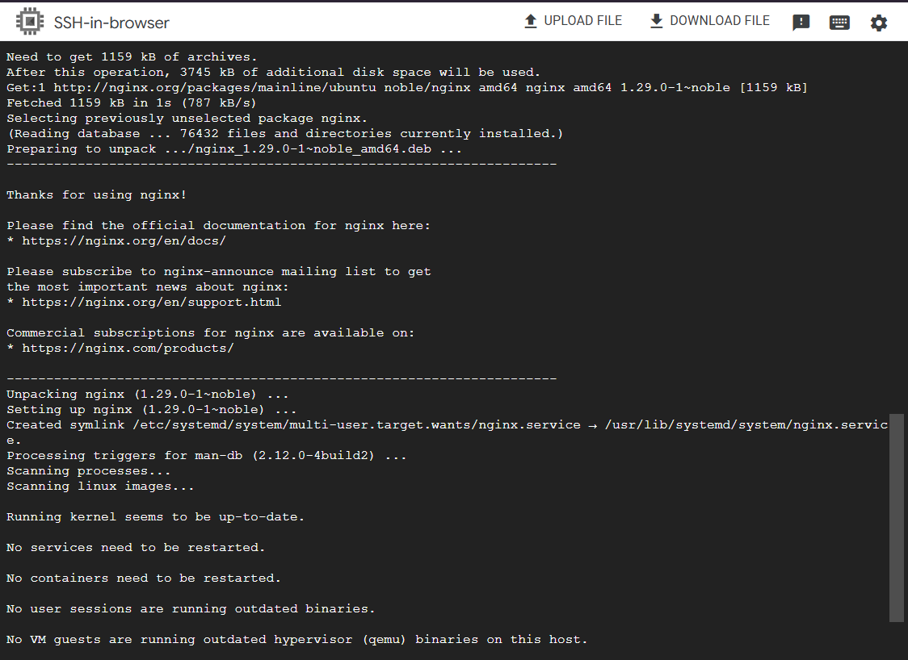
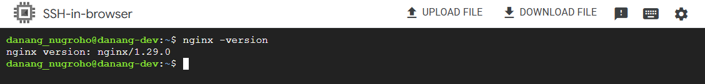

# Nginx

## Installation instructions

Reference : [nginx installation](https://nginx.org/en/linux_packages.html)

### Ubuntu

1. Install the prerequisites:

```bash
sudo apt install curl gnupg2 ca-certificates lsb-release ubuntu-keyring
```

2. Import an official nginx signing key so apt could verify the packages authenticity. Fetch the key:

```bash
curl https://nginx.org/keys/nginx_signing.key | gpg --dearmor \
    | sudo tee /usr/share/keyrings/nginx-archive-keyring.gpg >/dev/null
```

3. Verify that the downloaded file contains the proper key:

```bash
gpg --dry-run --quiet --no-keyring --import --import-options import-show /usr/share/keyrings/nginx-archive-keyring.gpg
```

4. The output should contain the full fingerprint `573BFD6B3D8FBC641079A6ABABF5BD827BD9BF62` as follows:

```bash
pub   rsa2048 2011-08-19 [SC] [expires: 2027-05-24]
      573BFD6B3D8FBC641079A6ABABF5BD827BD9BF62
uid                      nginx signing key <signing-key@nginx.com>
```

> Note that the output can contain other keys used to sign the packages.

5. To set up the apt repository for stable nginx packages, run the following command:

```bash
echo "deb [signed-by=/usr/share/keyrings/nginx-archive-keyring.gpg] \
http://nginx.org/packages/ubuntu `lsb_release -cs` nginx" \
    | sudo tee /etc/apt/sources.list.d/nginx.list
```

6. If you would like to use mainline nginx packages, run the following command instead:

```bash
echo "deb [signed-by=/usr/share/keyrings/nginx-archive-keyring.gpg] \
http://nginx.org/packages/mainline/ubuntu `lsb_release -cs` nginx" \
    | sudo tee /etc/apt/sources.list.d/nginx.list
```

7. Set up repository pinning to prefer our packages over distribution-provided ones:

```bash
echo -e "Package: *\nPin: origin nginx.org\nPin: release o=nginx\nPin-Priority: 900\n" \
    | sudo tee /etc/apt/preferences.d/99nginx
```

8. To install nginx, run the following commands:

> On Ubuntu/Debian

```bash
sudo apt update
sudo apt install nginx
```

> On RHEL/CentOS

```bash
sudo yum install epel-release -y
sudo yum install nginx -y
```

> Using Docker (Recommended for DevOps)

```bash
docker run --name nginx -p 8080:80 -d nginx
```





