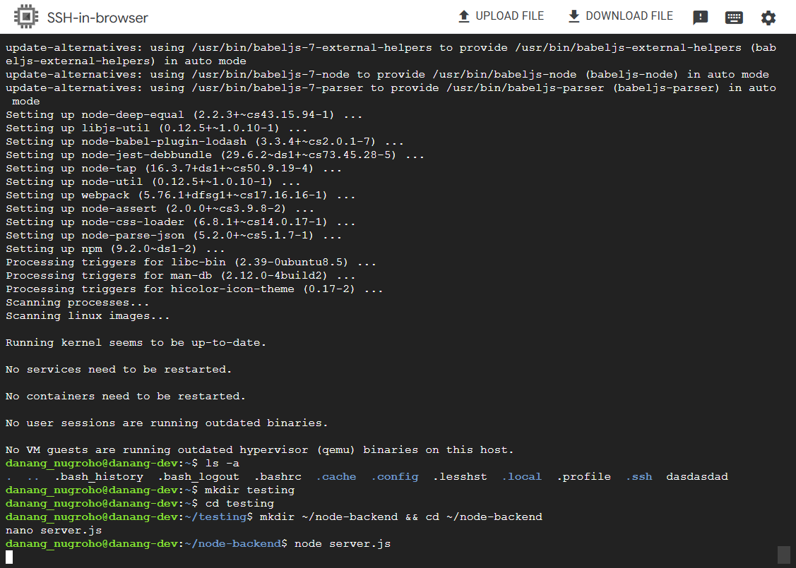
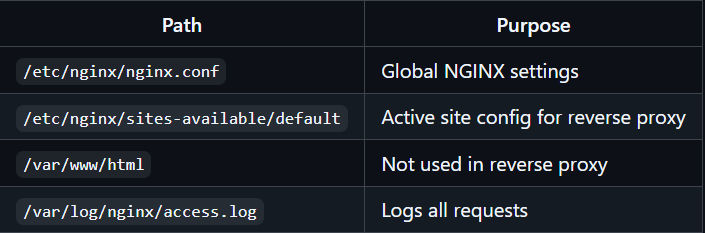

# NGINX as a Reverse Proxy (Ubuntu/Linux)

## Reverse Proxy to a Node.js App

### Step 1: Install Node.js (optional if using your own backend)

```bash
sudo apt update
sudo apt install nodejs npm -y
```

### Step 2: Create a simple backend app

```bash
mkdir ~/node-backend && cd ~/node-backend
nano server.js
```

#### Paste this:

```js
const http = require('http');
http.createServer((req, res) => {
  res.end('Hello from Node.js backend!');
}).listen(3000);
```

#### Run it:

```bash
node server.js
```
> Your app is now running at http://localhost:3000




### Step 3: Configure NGINX as reverse proxy

Edit the NGINX default site:

```bash
sudo nano /etc/nginx/conf.d/default.conf
```

Replace the location / {} block with:

```bash
location / {
    proxy_pass http://IP-Public:3000;
    proxy_set_header Host $host;
    proxy_set_header X-Real-IP $remote_addr;
}
```

Breakdown:
1. proxy_pass → forwards requests to your backend app
2. proxy_set_header → preserves original request metadata (like IP and host)

> Notes : Remember to use root user (sudo su)


### Step 4: Test and reload NGINX

Check config for syntax errors:

```bash
sudo nginx -t
```

Reload NGINX:

```bash
sudo systemctl reload nginx
```

### Step 5: Test in browser

Visit:

```bash
http://localhost
```
> You should see: `Hello from Node.js backend!`

## File Structure Recap (Ubuntu)

